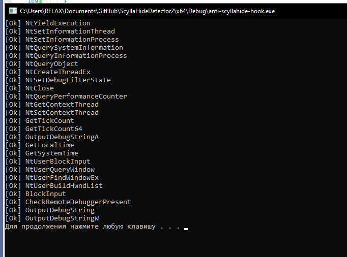
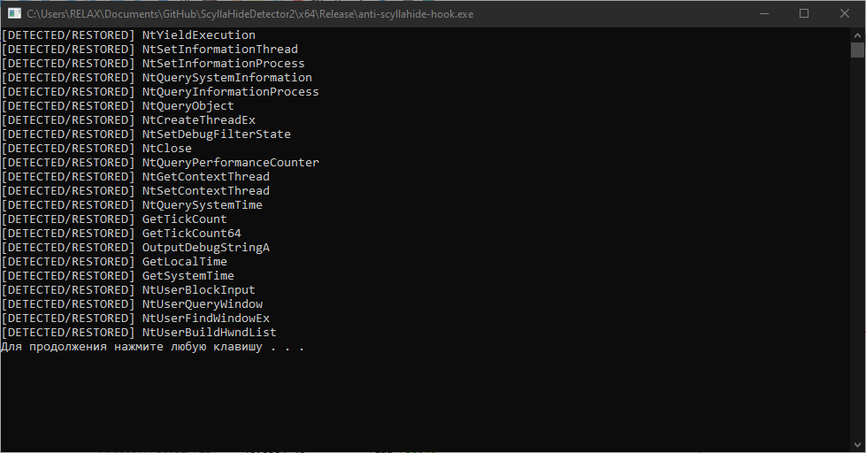

# ScyllaHide Detector V2
Allows you to find the use of ScyllaHide, if your program will debug and *restore bytes*.

Check `hide` branch if u need hidden code usage.

## TODO
- [ ] support x86 

## Done

- [x] NtSetInformationThread
- [x] NtSetInformationProcess
- [x] NtQuerySystemInformation
- [x] NtQueryInformationProcess
- [x] NtQueryObject
- [x] NtYieldExecution
- [x] NtCreateThreadEx
- [x] NtSetDebugFilterState
- [x] NtClose
- [x] NtQueryPerformanceCounter
- [x] NtGetContextThread
- [x] NtQuerySystemTime
- [x] GetTickCount
- [x] GetTickCount64
- [x] OutputDebugStringA
- [x] GetLocalTime
- [x] GetSystemTime
- [x] BlockInput/NtUserBlockInput
- [x] NtUserQueryWindow
- [x] NtUserFindWindowEx
- [x] NtUserBuildHwndList

## Screenshots

Detection

## Thanks
hiddy (inject.ws russian re forum)
